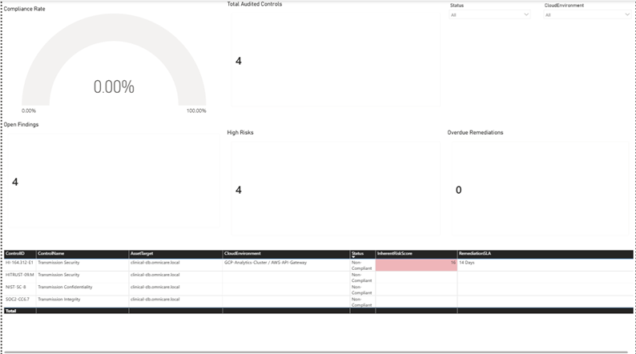
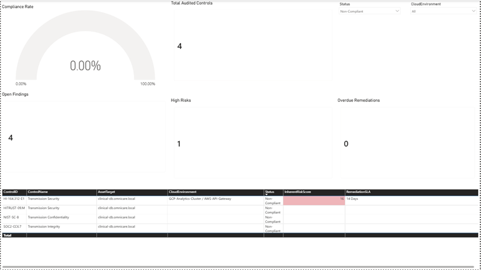

# AI GRC Compliance Intelligence Workbench (OmniCare Digital)


**Portfolio Disclaimer**

This is a simulated enterprise-style healthcare cybersecurity GRC project developed for educational and professional portfolio demonstration purposes. All organizations, assets, infrastructure components, vulnerabilities, and compliance data represented in this project are fictional.

---

## 📊 Dashboard Preview

### Global Compliance Posture



### Non-Compliant Risk Drill-Down



---

## Introduction
The AI-Powered Healthcare GRC Workbench is an enterprise-style cybersecurity compliance analytics platform designed for **OmniCare Digital**, a fictional cloud-native digital healthcare organization. This portfolio-grade solution demonstrates how technical security telemetry, risk management processes, and regulatory control frameworks (**HIPAA, NIST 800-53, and SOC 2**) can be unified into an executive compliance analytics dashboard.

---

## Key Features

- 📊 Executive compliance dashboard with real-time security metrics
- 🛡️ HIPAA, NIST 800-53, and SOC 2 control mapping
- 🔗 Relational data modeling using control-to-risk associations
- ⚠️ Risk-based prioritization using severity scores and remediation SLAs
- 🔍 Interactive filtering across cloud environments and compliance status
- 🤖 Future-ready architecture for AI-assisted GRC automation

---

## 📑 Table of Contents
- [Executive Summary & Business Case Analysis](#1-executive-summary--business-case-analysis)
- [Data Architecture & Relational Integrity](#2-data-architecture--relational-integrity)
- [UI/UX Design Engineering Decisions](#3-uiux-design-engineering-decisions)
- [Interactive Slicers & Operational Impact](#4-interactive-slicers--operational-impact)
- [Tech Stack](#6-tech-stack)
- [Repository Structure](#7-repository-structure)
- [Business Value & Technical Takeaways](#5-business-value--technical-takeaways)
- [Professional Skills Demonstrated](#8-professional-skills-demonstrated)
- [Future AI Enhancements](#9-future-ai-enhancements)

---

## 1. Executive Summary & Business Case Analysis

### The Strategic Alignment
In cloud-native healthcare environments, maintaining continuous compliance is a critical business driver for market entry, trust optimization, and liability mitigation. Digital healthcare platforms operating within public clouds (e.g., GCP, AWS) process high volumes of Protected Health Information (PHI), placing them under strict federal and industry-mandated security scrutiny. 

### The Operational Challenge
Traditional GRC workflows rely on manual, retroactive documentation pipelines—predominantly static spreadsheets, isolated risk registers, and disconnected issue trackers. This creates severe friction points:
* **Siloed Technical Vulnerabilities:** Engineering teams track infrastructure configurations, container scans, and patch logs in DevOps pipelines, while compliance officers track regulatory standards in standalone frameworks.
* **Delayed Remediation Execution:** Security gaps are decoupled from formal Service Level Agreements (SLAs), causing critical findings to exceed remediation deadlines without visibility.
* **Audit Preparation Overheads:** Preparing compliance evidence for external HIPAA or SOC 2 assessors takes weeks of manual retroactive mapping, leading to high human-error risk and audit strain.

### The Engineered Solution
The **OmniCare Digital GRC Workbench** centralizes these disparate data streams into an interactive dashboard. By consolidating a master control framework with active technical risk registries, the workbench provides:
1. **Continuous Audit Readiness:** Automates control-mapping to serve as dynamic audit evidence, drastically shrinking preparation cycles.
2. **Proactive SLA Tracking:** Aggregates risk scores and countdown timelines right next to impacted assets to optimize engineering remediation velocity.
3. **Executive Posture Transparency:** Summarizes global compliance health through high-impact KPI matrices designed for leadership and regulatory reviews.

---

## 2. Data Architecture & Relational Integrity

The architectural integrity of the workbench relies on a precise relational structure connecting regulatory frameworks directly to active security operations data.

### Data Schema & Joining Logic
The data model connects two principal tables through an intentional **Left Outer Join** mapped on the primary key `ControlID`:

1. **`master_hipaa_crosswalk` (Left / Parent Table):** The definitive organizational catalog of evaluated standards. It contains fields such as `ControlID`, `ControlName`, `Domain`, and formal regulatory text strings.
2. **`risk_register` (Right / Child Table):** The operational log of live vulnerabilities, containing technical metadata including `AssetTarget`, `CloudEnvironment`, `InherentRiskScore`, and `RemediationSLA`.

```
       +-------------------------------+          +-------------------------------+
       |    master_hipaa_crosswalk     |          |         risk_register         |
       +-------------------------------+          +-------------------------------+
       |  ControlID (Primary Key) [PK] |          |  ControlID (Foreign Key) [FK] |
       |  ControlName                  |   LEFT   |  AssetTarget                  |
       |  Domain                       | -------->|  CloudEnvironment             |
       |  Status                       |   JOIN   |  InherentRiskScore            |
       |  ComplianceRate               |          |  RemediationSLA               |
       +-------------------------------+          +-------------------------------+
```

### Preventing Artificial Posture Inflation
A critical engineering choice was implementing a **Left Outer Join** rather than a standard Inner Join. 

* **The Pitfall of Inner Joins:** If an Inner Join were used, any regulatory control that does not currently have an active finding or vulnerability in the `risk_register` would be entirely omitted from the data model. This would hide unreviewed controls, artificially inflating the global compliance rate.

* **The Left Join Solution:** By utilizing a Left Outer Join, every single audited control remains anchored on the reporting canvas. Controls without active findings display blank fields (formatted as professional empty spaces), preserving the complete operational footprint and giving auditors an honest view of compliance health.

---

## 3. UI/UX Design Engineering Decisions

The frontend layout was engineered to optimize scannability for both internal compliance analysts and external federal assessors. 

### High-Impact Metric Hierarchy
The user interface avoids complex, cluttered layouts in favor of an intuitive, multi-tiered visual hierarchy:
* **The Top-Level Posture Row:** Centers on a dynamic **Global Compliance Rate Gauge** calibrated to track real-time posture changes alongside a **Total Audited Controls** indicator. This instantly establishes baseline security confidence.
* **The Balanced Executive KPI Block:** Displays operational liabilities transparently using three dedicated cards: **Open Findings**, **High Risks**, and **Overdue Remediations**. This guarantees that severe technical issues can never hide behind a high global compliance score.

### Professional Data Hygiene & Readability Configurations
* **Column Auto-Sizing & Explicit Text-Wrapping:** Regulatory framework descriptions (e.g., `Transmission Confidentiality` under NIST/HIPAA) feature long text strings. Text wrapping is fully enabled across the main **Audit Details Matrix**, preventing clipped strings or rigid borders from breaking text readability.
* **Clean Empty-Cell Strategy:** Fields with missing risk data or unflagged controls are configured to render as clean spaces rather than displaying messy error flags or misleading `0` values, keeping the interface crisp and highly readable.
* **Proactive Conditional Heat Mapping:** Localized formatting rules apply a soft alert-red gradient directly to the `InherentRiskScore` column. The logic is configured to completely ignore empty cells, while active, high-exposure technical vulnerabilities (such as a critical 16-point infrastructure vulnerability) automatically pop out visually to instantly draw an auditor’s attention.

---

## 4. Interactive Slicers & Operational Impact

The workspace features classic dropdown toolbar components for **CloudEnvironment** and **Status** fields, transitioning the platform from a static report into a multi-dimensional analysis application.

### Slicer Configuration & Filter Behavior
To maintain exceptional data integrity during review cycles, the interactive slicers are configured as follows:
* **`Single select` = Off:** Allows users to view the entire infrastructure footprint simultaneously by default.
* **`Show "Select all" option` = On:** Places an instantaneous reset switch at the top of the dropdown menu to quickly clear active drill-downs.
* **`Multi-select with Ctrl` = On:** Enables advanced reviewers to slice and aggregate specific permutations of multiple cloud environments or target vectors simultaneously.

### 📊 Interactive Dashboard Walkthrough

#### 1. Baseline Compliance Posture (Global Corporate View)
When both slicers are resting in the **"Select all" / Unfiltered** state, the canvas delivers a comprehensive summary of the total organizational footprint. This gives leadership a unified dashboard of compliance wellness across all environments and frameworks.


*Figure 1: Default dashboard view showcasing global compliance metrics across all integrated control sets.*

#### 2. Real-Time Risk Isolation (Active Audit Drill-Down View)
When an assessor interacts with the toolbar and filters the status specifically to **Non-Compliant**, the workbench dynamically pivots. The KPI counters instantly recalibrate to track targeted risk counts, and the central details matrix narrows down to isolate critical exposures (e.g., a critical infrastructure vulnerability with a score of `16` affecting the production endpoint `clinical-db.omnicare.local`).


*Figure 2: Active drill-down state displaying metric synchronization when isolating Non-Compliant controls.*

---

## 5. Business Value & Technical Takeaways

### Operational ROI

* **Audit Preparation Efficiency:** Demonstrates how continuous monitoring and centralized evidence visibility can potentially reduce manual audit preparation effort and improve assessment readiness.

* **Risk-Based Remediation Visibility:** Illustrates how linking risks, affected assets, and remediation SLAs can improve accountability and prioritize security efforts.

* **Data Quality & Reporting Integrity:** Demonstrates the importance of structured data modeling and filtering to ensure dashboard metrics represent meaningful compliance insights.

---

## 6. Tech Stack

| Category | Technologies |
|---|---|
| Dashboard | Power BI |
| Data Sources | Excel, CSV |
| Data Modeling | Power Query, Relational Data Modeling |
| Frameworks | HIPAA, NIST 800-53, SOC 2 |
| Risk Analytics | Risk Scoring, SLA Tracking |
| Visualization | KPI Cards, Gauges, Slicers, Conditional Formatting |

---

## 7. Repository Structure
```
ai-powered-grc-workbench/
├── data/
├── images/
├── dashboard/
├── README.md
└── documentation/
```

---

## 8. Professional Skills Demonstrated

- Cybersecurity GRC Analytics
- HIPAA Security Rule Compliance
- NIST 800-53 Control Mapping
- SOC 2 Readiness Monitoring
- Risk Register Management
- Power BI Dashboard Development
- Security Metrics & Executive Reporting
- Data Modeling & Transformation
- Continuous Compliance Monitoring

---

## 9. Future AI-Driven GRC Enhancements

Future versions of this workbench could evolve from a compliance reporting interface into a proactive, continuous compliance intelligence platform through capabilities such as:

### 🤖 AI-Powered Compliance Intelligence
- LLM-powered compliance evidence search
- Automated control-to-framework crosswalking
- Conversational audit assistant for natural language compliance queries

### 🔍 Intelligent Risk Analytics
- Machine learning-based risk prediction
- Predictive SLA drift tracking based on historical remediation trends
- Automated identification of emerging compliance gaps

### 🛠️ AI-Assisted Remediation
- AI-generated remediation recommendations
- Automated security configuration guidance
- Context-aware engineering remediation playbooks

---

*Developed as part of the CyberGRC Professional Portfolio Project.*
